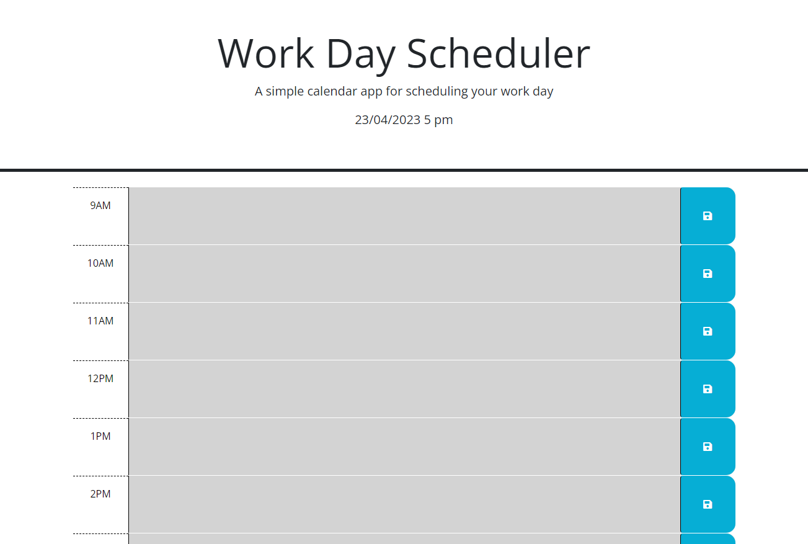
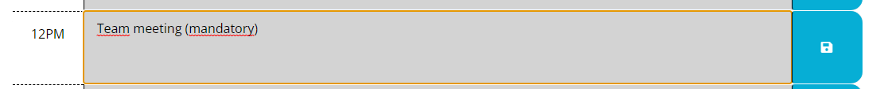
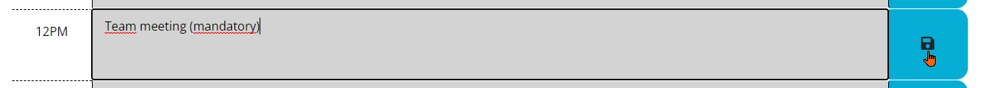

# <YWork day Scheduler>

## Description

This project was made in order to help keep track of daily work activities , hence the reason the time gap considered for this project covers from 9am to 6pm.
This project involves the usage of tools like jquery, in order to achieve the desired function.

## Usage

This project helps users keep track of activites during the work day, bay differentiating by color the hours, separating them by hours passed in grey color, current hour in color red and finally future hours of the day in color green.

This project loads empty and with the timeboxes colored dependig on the current time. Like in the picture below:

As seen in the above picture the web page consits of 3 columns the time column, which indicates the time of the day for which you want to schedule an activity, the input column (this is the column that loads in different color depending on the current time) for the example above all boxes are colored grey due to the time in which the picture was taken. And finally the save button column, where the save button is located for each row.

Once you have selected the time to schedule any activity, you can write said activity inside the input section of the selected time, for example I will select 12pm in order to schedule a team-meating

In order to save the scheduled meeting simply click on the save button that corresponds to the time selected.

That´s it! If you now choose to refresh the page then it will show the information of any saved scheduled activites.

## Credits

The web page was done by Hector Vazquez (myself) using provided code with visual examples of how the page should function.
I finished the web page´s functionality with the amazing tutoring of Abdullah Al Hilfi!

## Link to deployed application

https://enrique-v06.github.io/HEVM-Challenge-5/ 
